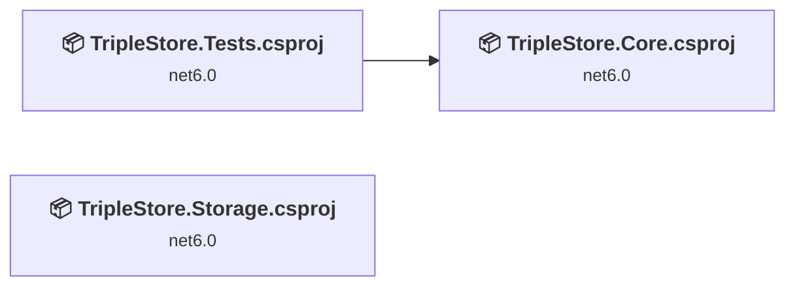
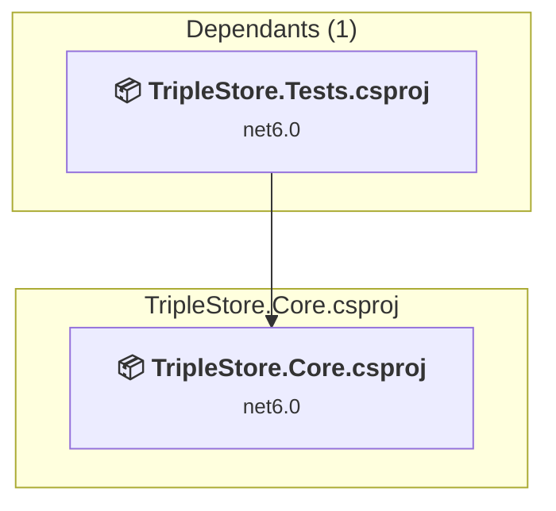
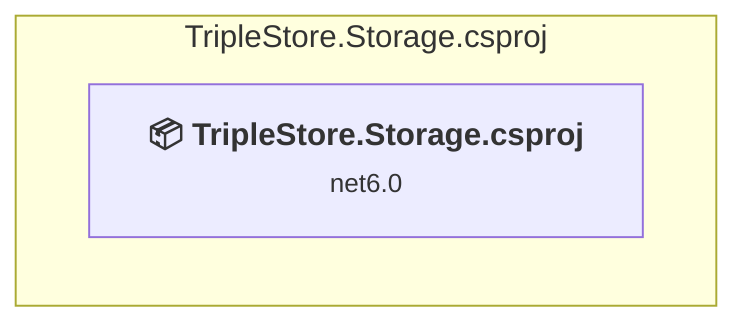
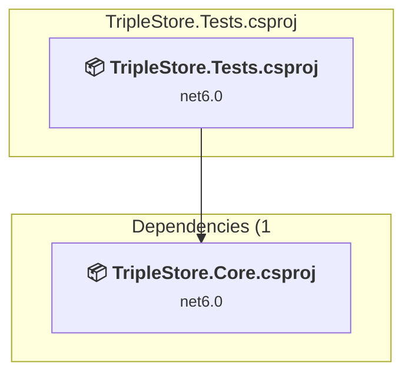

# Projects and dependencies analysis

This document provides a comprehensive overview of the projects and their dependencies in the context of upgrading to .NET 9.0.

## Table of Contents

- [Projects Relationship Graph](#projects-relationship-graph)
- [Project Details](#project-details)

  - [src\TripleStore.Core\TripleStore.Core.csproj](#srctriplestorecoretriplestorecorecsproj)
  - [src\TripleStore.Storage\TripleStore.Storage.csproj](#srctriplestorestoragetriplestorestoragecsproj)
  - [test\TripleStore.Tests\TripleStore.Tests.csproj](#testtriplestoreteststriplestoretestscsproj)
- [Aggregate NuGet packages details](#aggregate-nuget-packages-details)

## Projects Relationship Graph

Legend:
📦 SDK-style project
⚙️ Classic project

## Project Details

### src\TripleStore.Core\TripleStore.Core.csproj

#### Project Info

- **Current Target Framework:** net6.0
- **Proposed Target Framework:** net10.0
- **SDK-style**: True
- **Project Kind:** ClassLibrary
- **Dependencies**: 0
- **Dependants**: 1
- **Number of Files**: 17
- **Lines of Code**: 890

#### Dependency Graph

Legend:
📦 SDK-style project
⚙️ Classic project

#### Project Package References

| Package | Type | Current Version | Suggested Version | Description |
| :--- | :---: | :---: | :---: | :--- |

### src\TripleStore.Storage\TripleStore.Storage.csproj

#### Project Info

- **Current Target Framework:** net6.0
- **Proposed Target Framework:** net10.0
- **SDK-style**: True
- **Project Kind:** ClassLibrary
- **Dependencies**: 0
- **Dependants**: 0
- **Number of Files**: 3
- **Lines of Code**: 110

#### Dependency Graph

Legend:
📦 SDK-style project
⚙️ Classic project

#### Project Package References

| Package | Type | Current Version | Suggested Version | Description |
| :--- | :---: | :---: | :---: | :--- |
| LightningDB | Explicit | 0.14.0 |  | ✅Compatible |

### test\TripleStore.Tests\TripleStore.Tests.csproj

#### Project Info

- **Current Target Framework:** net6.0
- **Proposed Target Framework:** net10.0
- **SDK-style**: True
- **Project Kind:** DotNetCoreApp
- **Dependencies**: 1
- **Dependants**: 0
- **Number of Files**: 7
- **Lines of Code**: 386

#### Dependency Graph

Legend:
📦 SDK-style project
⚙️ Classic project

#### Project Package References

| Package | Type | Current Version | Suggested Version | Description |
| :--- | :---: | :---: | :---: | :--- |
| AutoFixture.NUnit3 | Explicit | 4.17.0 |  | ✅Compatible |
| coverlet.collector | Explicit | 3.1.0 |  | ✅Compatible |
| FluentAssertions | Explicit | 6.2.0 |  | ✅Compatible |
| Microsoft.NET.Test.Sdk | Explicit | 16.11.0 |  | ✅Compatible |
| NUnit | Explicit | 3.13.2 |  | ✅Compatible |
| NUnit3TestAdapter | Explicit | 4.0.0 |  | ✅Compatible |

## Aggregate NuGet packages details

| Package | Current Version | Suggested Version | Projects | Description |
| :--- | :---: | :---: | :--- | :--- |
| AutoFixture.NUnit3 | 4.17.0 |  | [TripleStore.Tests.csproj](#triplestoretestscsproj) | ✅Compatible |
| coverlet.collector | 3.1.0 |  | [TripleStore.Tests.csproj](#triplestoretestscsproj) | ✅Compatible |
| FluentAssertions | 6.2.0 |  | [TripleStore.Tests.csproj](#triplestoretestscsproj) | ✅Compatible |
| LightningDB | 0.14.0 |  | [TripleStore.Storage.csproj](#triplestorestoragecsproj) | ✅Compatible |
| Microsoft.NET.Test.Sdk | 16.11.0 |  | [TripleStore.Tests.csproj](#triplestoretestscsproj) | ✅Compatible |
| NUnit | 3.13.2 |  | [TripleStore.Tests.csproj](#triplestoretestscsproj) | ✅Compatible |
| NUnit3TestAdapter | 4.0.0 |  | [TripleStore.Tests.csproj](#triplestoretestscsproj) | ✅Compatible |

