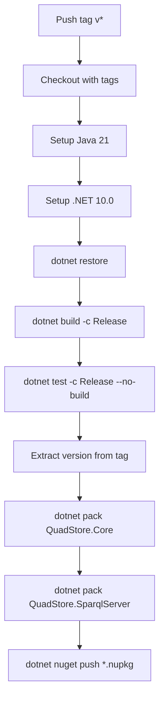

# Design Document: NuGet Publish GitHub Action

## Overview

This design describes a GitHub Actions workflow (`publish.yml`) that automates building, testing, and publishing the QuadStore.Core and QuadStore.SparqlServer libraries as NuGet packages to nuget.org. The workflow triggers on version tags (`v*`), extracts the version from the tag, builds the solution in Release configuration (including ANTLR parser generation via Java), runs the xUnit test suite, packs both library projects, and pushes the resulting `.nupkg` files to nuget.org.

The design also covers the required NuGet package metadata additions to both `.csproj` files so that published packages are properly identified on nuget.org.

## Architecture

The workflow is a single-job GitHub Actions pipeline with sequential steps:



Key design decisions:

1. **Single job** — Build, test, pack, and publish run in one job. This keeps the workflow simple and avoids artifact passing between jobs. The entire pipeline takes under 5 minutes for this project size.

2. **Tag-triggered only** — Using `on: push: tags: ['v*']` ensures the workflow never runs on regular commits or PRs, preventing accidental publishes.

3. **Version from tag** — The version is extracted by stripping the `v` prefix from `GITHUB_REF_NAME` (e.g., `v1.2.3` → `1.2.3`). This is passed to `dotnet pack` via `/p:Version=` so the `.nupkg` version matches the Git tag exactly.

4. **Java before .NET** — Java must be available before `dotnet build` because QuadStore.Core's `InitialTargets="GenerateParser"` invokes `java -jar` to run the ANTLR tool. Setting up Java first ensures the build step succeeds.

5. **`--skip-duplicate` on push** — Using `--skip-duplicate` on `dotnet nuget push` means re-pushing an existing version won't fail the workflow, which is important for idempotent re-runs.

## Components and Interfaces

### Component 1: Workflow File (`.github/workflows/publish.yml`)

The YAML workflow file defining the entire CI/CD pipeline.

**Trigger configuration:**
```yaml
on:
  push:
    tags:
      - 'v*'
```

**Job steps:**
- `actions/checkout@v4` with `fetch-depth: 0` to include all tags
- `actions/setup-java@v4` with `distribution: temurin`, `java-version: 21`
- `actions/setup-dotnet@v4` with `dotnet-version: 10.0.x`
- `dotnet restore QuadStore.sln`
- `dotnet build QuadStore.sln -c Release --no-restore`
- `dotnet test QuadStore.sln -c Release --no-build --nologo`
- Version extraction via shell: `echo "VERSION=${GITHUB_REF_NAME#v}" >> $GITHUB_ENV`
- `dotnet pack src/QuadStore.Core/QuadStore.Core.csproj -c Release --no-build /p:Version=${{ env.VERSION }} -o ./nupkgs`
- `dotnet pack src/QuadStore.SparqlServer/QuadStore.SparqlServer.csproj -c Release --no-build /p:Version=${{ env.VERSION }} -o ./nupkgs`
- `dotnet nuget push ./nupkgs/*.nupkg --source https://api.nuget.org/v3/index.json --api-key ${{ secrets.NUGET_API_KEY }} --skip-duplicate`

**Interfaces:**
- Input: Git tag push event
- Secrets: `NUGET_API_KEY` (repository secret)
- Output: Published `.nupkg` files on nuget.org

### Component 2: QuadStore.Core Package Metadata

NuGet metadata properties added to `src/QuadStore.Core/QuadStore.Core.csproj`:

```xml
<PropertyGroup>
  <PackageId>QuadStore.Core</PackageId>
  <Authors>aabs</Authors>
  <Description>A high-performance, lightweight in-memory RDF quad store for .NET with roaring bitmap indexes, single-pass TriG loading, and SPARQL support.</Description>
  <PackageLicenseExpression>MIT</PackageLicenseExpression>
  <PackageProjectUrl>https://github.com/aabs/QuadStore</PackageProjectUrl>
  <RepositoryUrl>https://github.com/aabs/QuadStore</RepositoryUrl>
  <PackageReadmeFile>README.md</PackageReadmeFile>
</PropertyGroup>
<ItemGroup>
  <None Include="../../README.md" Pack="true" PackagePath="/" />
</ItemGroup>
```

### Component 3: QuadStore.SparqlServer Package Metadata

NuGet metadata properties added to `src/QuadStore.SparqlServer/QuadStore.SparqlServer.csproj`:

```xml
<PropertyGroup>
  <PackageId>QuadStore.SparqlServer</PackageId>
  <Authors>aabs</Authors>
  <Description>ASP.NET Core SPARQL Protocol endpoint for QuadStore.</Description>
  <PackageLicenseExpression>MIT</PackageLicenseExpression>
  <PackageProjectUrl>https://github.com/aabs/QuadStore</PackageProjectUrl>
  <RepositoryUrl>https://github.com/aabs/QuadStore</RepositoryUrl>
  <PackageReadmeFile>README.md</PackageReadmeFile>
</PropertyGroup>
<ItemGroup>
  <None Include="../../README.md" Pack="true" PackagePath="/" />
</ItemGroup>
```

## Data Models

### Workflow YAML Schema

The workflow file follows the GitHub Actions workflow schema. Key data structures:

| Field | Type | Value |
|-------|------|-------|
| `on.push.tags` | string[] | `['v*']` |
| `jobs.publish.runs-on` | string | `ubuntu-latest` |
| `env.VERSION` | string | Extracted from `GITHUB_REF_NAME` (e.g., `1.2.3`) |
| `secrets.NUGET_API_KEY` | string | NuGet.org API key (stored in GitHub repo settings) |

### NuGet Package Metadata Properties

| MSBuild Property | QuadStore.Core | QuadStore.SparqlServer |
|-----------------|----------------|----------------------|
| `PackageId` | `QuadStore.Core` | `QuadStore.SparqlServer` |
| `Version` | Set at pack time via `/p:Version` | Set at pack time via `/p:Version` |
| `Authors` | `aabs` | `aabs` |
| `PackageLicenseExpression` | `MIT` | `MIT` |
| `PackageProjectUrl` | `https://github.com/aabs/QuadStore` | `https://github.com/aabs/QuadStore` |
| `RepositoryUrl` | `https://github.com/aabs/QuadStore` | `https://github.com/aabs/QuadStore` |
| `PackageReadmeFile` | `README.md` | `README.md` |

### Output Artifacts

Each `dotnet pack` invocation produces a `.nupkg` file in the `./nupkgs/` directory:
- `QuadStore.Core.{VERSION}.nupkg`
- `QuadStore.SparqlServer.{VERSION}.nupkg`


## Correctness Properties

*A property is a characteristic or behavior that should hold true across all valid executions of a system — essentially, a formal statement about what the system should do. Properties serve as the bridge between human-readable specifications and machine-verifiable correctness guarantees.*

Most acceptance criteria for this feature are structural checks on YAML and XML files (verifying specific steps, fields, or values exist). These are best validated as example-based tests. The following properties capture the universally quantifiable behaviors.

### Property 1: Version tag pattern matching

*For any* string that starts with `v` followed by one or more characters, the workflow trigger pattern `v*` shall match it. *For any* string that does not start with `v`, the pattern shall not match.

**Validates: Requirements 1.1, 1.2, 1.3**

### Property 2: Version extraction preserves semver

*For any* valid semantic version string (e.g., `1.0.0`, `2.3.1-beta`), prefixing it with `v` and then stripping the leading `v` shall produce the original version string. This is a round-trip property on the version extraction logic.

**Validates: Requirements 4.1, 4.3**

### Property 3: Required NuGet metadata fields are present in all publishable projects

*For any* publishable project (QuadStore.Core, QuadStore.SparqlServer) and *for any* required metadata field in the set {PackageId, Authors, Description, PackageLicenseExpression, PackageProjectUrl, RepositoryUrl, PackageReadmeFile}, the project's `.csproj` file shall contain a non-empty XML element for that field.

**Validates: Requirements 6.1, 6.2**

## Error Handling

| Failure Scenario | Behavior | Mechanism |
|-----------------|----------|-----------|
| Build failure (compile error) | Workflow stops, no packages published | GitHub Actions default step failure propagation |
| Test failure | Workflow stops, no packages published | GitHub Actions default step failure propagation |
| Pack failure | Workflow stops, no packages pushed | GitHub Actions default step failure propagation |
| Duplicate version on nuget.org | Push step skips that package, workflow succeeds | `--skip-duplicate` flag on `dotnet nuget push` |
| Invalid/expired NUGET_API_KEY | Push step fails with 401/403, workflow fails | `dotnet nuget push` returns non-zero exit code |
| Missing NUGET_API_KEY secret | Push step fails (empty API key), workflow fails | GitHub Actions secret resolution returns empty string |
| Java not available (setup-java fails) | Build step fails (ANTLR can't run), workflow stops | `InitialTargets="GenerateParser"` exec fails |
| Tag doesn't match semver | Pack succeeds with non-semver version string | No validation — NuGet accepts arbitrary version strings |

No custom error handling code is needed. GitHub Actions' default behavior (fail-fast on non-zero exit codes) provides the correct stop-on-failure semantics required by Requirements 2.3 and 3.2.

## Testing Strategy

### Dual Testing Approach

This feature is primarily infrastructure (YAML workflow + XML metadata), so testing focuses on structural validation of the generated files rather than runtime behavior.

**Unit tests (example-based):**
- Verify the workflow YAML contains all required steps in correct order
- Verify specific field values (PackageId = `QuadStore.Core`, license = `MIT`, etc.)
- Verify the checkout step uses `fetch-depth: 0` for tag access
- Verify `--skip-duplicate` is present on the push command
- Verify Java setup precedes the build step
- Verify both pack steps target the correct `.csproj` paths

**Property-based tests:**
- Use FsCheck.Xunit (already in the test project) for property-based testing
- Minimum 100 iterations per property test
- Each property test must reference its design document property with a comment tag

**Property test configuration:**
- Library: `FsCheck.Xunit` 3.3.2 (already a dependency in `test/QuadStore.Tests/`)
- Framework: xUnit with `[Property]` attribute
- Minimum iterations: 100 (FsCheck default is higher, which is fine)
- Tag format in test comments: `// Feature: nuget-publish-github-action, Property {number}: {property_text}`

**Property test plan:**

| Property | Test Description | Generator |
|----------|-----------------|-----------|
| Property 1: Version tag pattern matching | Generate random strings, verify `v*` glob matching is correct | Random alphanumeric strings, some prefixed with `v`, some not |
| Property 2: Version extraction preserves semver | Generate random semver strings, prefix with `v`, strip `v`, compare | Random `{major}.{minor}.{patch}` and `{major}.{minor}.{patch}-{prerelease}` strings |
| Property 3: Required metadata fields present | For each publishable project × required field, parse .csproj XML and assert field exists with non-empty value | Cartesian product of project paths and required field names |

**What is NOT tested:**
- Actual GitHub Actions execution (requires pushing tags to a real repo)
- NuGet.org authentication and push (requires real API key and network)
- ANTLR parser generation in CI (tested by the build step itself)
- These are integration concerns validated by the first real tag push after merging the workflow
