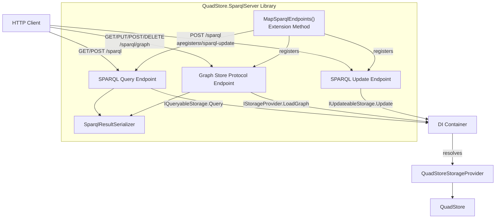
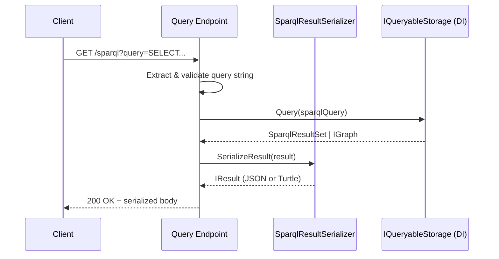
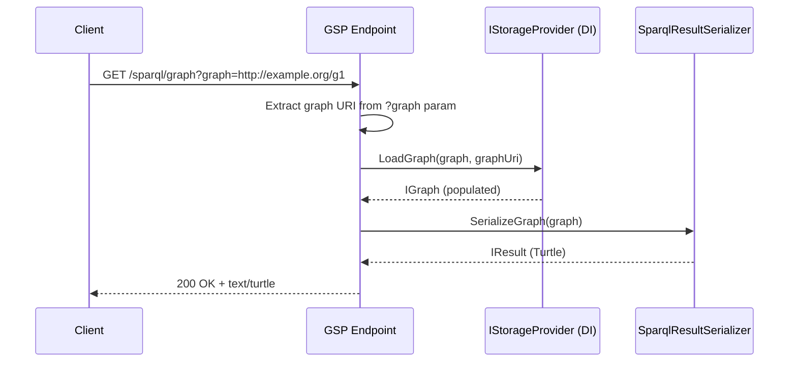

# Design Document: SPARQL Server Library Extraction

## Overview

This design describes extracting the reusable SPARQL HTTP server logic from `samples/SparqlServerOverMinimalApi/Program.cs` into a new class library at `src/QuadStore.SparqlServer/`. The library exposes a single extension method `MapSparqlEndpoints` on `IEndpointRouteBuilder` that registers SPARQL Protocol query endpoints (GET/POST), a SPARQL Update endpoint, and Graph Store Protocol endpoints — all backed by an `IQueryableStorage` resolved from DI.

The extraction follows a clean separation: the library owns HTTP routing, content negotiation, query dispatch, and result serialization. The sample app retains store initialization, seed data, DI registration, and lifecycle management. Existing integration tests and property-based tests continue to work unchanged since they test through `WebApplicationFactory<Program>` against the sample app, which now delegates to the library.

Key design decisions:

1. **Extension method pattern**: A single `MapSparqlEndpoints(routePrefix)` call registers all endpoints. This mirrors the ASP.NET Core convention (e.g., `MapControllers()`, `MapHub<T>()`).
2. **IQueryableStorage abstraction**: The library never references `QuadStore` directly. It resolves `IQueryableStorage` from DI, making it usable with any dotNetRDF-compatible storage backend.
3. **501 for unsupported operations**: SPARQL Update and Graph Store write operations (PUT/POST/DELETE) are registered but return HTTP 501 with `NotImplementedException`, since `QuadStoreStorageProvider` is append-only and doesn't support these operations.
4. **Shared serialization logic**: The `SerializeResult` helper moves from the sample's local function into a static helper class in the library.

## Architecture



### Request Flow — SPARQL Query



### Request Flow — Graph Store GET



### Key Design Decisions

1. **Single extension method**: `MapSparqlEndpoints` registers all routes in one call. The route prefix defaults to `"/sparql"` and the graph store sub-path defaults to `"{prefix}/graph"`.
2. **POST handler dispatches by Content-Type**: The POST handler at the query route inspects `Content-Type` to distinguish between `application/sparql-query` (query), `application/sparql-update` (update), and `application/x-www-form-urlencoded` (form-encoded query). This follows the SPARQL 1.1 Protocol spec where query and update share the same endpoint path but differ by content type.
3. **IStorageProvider for Graph Store**: The Graph Store GET endpoint needs `LoadGraph()` which is on `IStorageProvider`, not `IQueryableStorage`. The library resolves `IQueryableStorage` from DI and casts to `IStorageProvider` at runtime (since `QuadStoreStorageProvider` implements both). If the cast fails, GSP endpoints return 501.
4. **Static serialization helper**: `SparqlResultSerializer` is a static class with methods for serializing `SparqlResultSet` → JSON and `IGraph` → Turtle. This avoids duplicating serialization logic across endpoints.
5. **Namespace**: `TripleStore.SparqlServer` — consistent with the existing `TripleStore.Core` convention.

## Components and Interfaces

### 1. Project File (`QuadStore.SparqlServer.csproj`)

```xml
<Project Sdk="Microsoft.NET.Sdk">
  <PropertyGroup>
    <TargetFramework>net10.0</TargetFramework>
    <ImplicitUsings>enable</ImplicitUsings>
    <Nullable>enable</Nullable>
    <LangVersion>latest</LangVersion>
  </PropertyGroup>
  <ItemGroup>
    <FrameworkReference Include="Microsoft.AspNetCore.App" />
    <ProjectReference Include="..\QuadStore.Core\QuadStore.Core.csproj" />
  </ItemGroup>
</Project>
```

Uses `Microsoft.NET.Sdk` (not Web SDK) with a `FrameworkReference` to `Microsoft.AspNetCore.App` for access to `IEndpointRouteBuilder`, `Results`, `HttpContext`, etc. without requiring the host project to use the Web SDK.

### 2. SparqlEndpointRouteBuilderExtensions.cs

The public API surface of the library. A single static class with one extension method:

```csharp
namespace TripleStore.SparqlServer;

public static class SparqlEndpointRouteBuilderExtensions
{
    public static IEndpointRouteBuilder MapSparqlEndpoints(
        this IEndpointRouteBuilder endpoints,
        string routePrefix = "/sparql")
    {
        // Registers:
        // - GET  {routePrefix}         → SPARQL query via query string
        // - POST {routePrefix}         → SPARQL query (direct/form) or SPARQL Update
        // - GET  {routePrefix}/graph   → Graph Store read
        // - PUT  {routePrefix}/graph   → Graph Store replace (501)
        // - POST {routePrefix}/graph   → Graph Store merge (501)
        // - DELETE {routePrefix}/graph → Graph Store delete (501)
    }
}
```

### 3. SparqlQueryHandler.cs

Internal static class containing the GET and POST handler logic for the SPARQL query endpoint:

- `HandleGet(HttpContext)`: Extracts `query` from query string, validates, executes, serializes.
- `HandlePost(HttpContext)`: Inspects `Content-Type`, dispatches to query or update logic.
- Shared error handling: `RdfParseException` → 400, `NotImplementedException` → 501, other → 500.

### 4. GraphStoreHandler.cs

Internal static class containing Graph Store Protocol handler logic:

- `HandleGet(HttpContext)`: Extracts `graph` query parameter, loads graph via `IStorageProvider.LoadGraph()`, serializes as Turtle.
- `HandlePut/HandlePost/HandleDelete(HttpContext)`: Return 501 with `NotImplementedException` message.

### 5. SparqlResultSerializer.cs

Internal static class with serialization helpers:

```csharp
internal static class SparqlResultSerializer
{
    public static IResult SerializeResult(object result);
    public static IResult SerializeGraph(IGraph graph);
}
```

- `SerializeResult`: Dispatches on `SparqlResultSet` vs `IGraph`, uses `SparqlJsonWriter` or `CompressingTurtleWriter`.
- `SerializeGraph`: Serializes an `IGraph` as Turtle (used by Graph Store GET).

### 6. Updated Sample App (`Program.cs`)

After extraction, the sample simplifies to:

```csharp
// Sections A, B, C remain (store init, seed data, DI registration)
// Section D, E, F removed (replaced by library call)

app.MapSparqlEndpoints();  // single line replaces ~80 lines of inline handlers

// Section G remains (shutdown)
```

### 7. External Dependencies

| Component | Source | Purpose |
|---|---|---|
| `IQueryableStorage` | dotNetRDF | Query execution abstraction |
| `IStorageProvider` | dotNetRDF | Graph loading for GSP |
| `SparqlJsonWriter` | dotNetRDF | SELECT/ASK → JSON serialization |
| `CompressingTurtleWriter` | dotNetRDF | CONSTRUCT/DESCRIBE/Graph → Turtle |
| `RdfParseException` | dotNetRDF | SPARQL parse error detection |
| `IEndpointRouteBuilder` | ASP.NET Core | Route registration |

## Data Models

### Request Models

No custom request models. Query strings are extracted directly from HTTP context:

| Endpoint | Method | Source |
|---|---|---|
| SPARQL Query | GET | `HttpContext.Request.Query["query"]` |
| SPARQL Query | POST `application/sparql-query` | `HttpContext.Request.Body` (read as string) |
| SPARQL Query | POST `application/x-www-form-urlencoded` | `HttpContext.Request.Form["query"]` |
| SPARQL Update | POST `application/sparql-update` | `HttpContext.Request.Body` (read as string) |
| Graph Store | GET | `HttpContext.Request.Query["graph"]` (optional) |

### Response Models

No custom response models. Responses use dotNetRDF writers directly:

| Query Type | dotNetRDF Result | Writer | Content-Type |
|---|---|---|---|
| SELECT, ASK | `SparqlResultSet` | `SparqlJsonWriter` | `application/sparql-results+json` |
| CONSTRUCT, DESCRIBE | `IGraph` | `CompressingTurtleWriter` | `text/turtle` |
| Graph Store GET | `IGraph` | `CompressingTurtleWriter` | `text/turtle` |

### Error Responses

Plain text responses:

| Condition | Status | Body |
|---|---|---|
| Missing/empty query | 400 | Descriptive message |
| Unsupported Content-Type | 400 | "Unsupported Content-Type..." |
| `RdfParseException` | 400 | Parse error message |
| `NotImplementedException` (Update, GSP write) | 501 | "SPARQL Update is not supported..." / "Graph Store ... not supported..." |
| Unexpected exception | 500 | "An internal error occurred while processing the query." |


## Correctness Properties

*A property is a characteristic or behavior that should hold true across all valid executions of a system — essentially, a formal statement about what the system should do. Properties serve as the bridge between human-readable specifications and machine-verifiable correctness guarantees.*

### Property 1: Response content-type matches query result type

*For any* valid SPARQL query executed against the endpoint, if the query is a SELECT or ASK (producing a `SparqlResultSet`), the response content-type SHALL be `application/sparql-results+json`; if the query is a CONSTRUCT or DESCRIBE (producing an `IGraph`), the response content-type SHALL be `text/turtle`.

**Validates: Requirements 3.3, 3.4, 9.1, 9.2, 9.3, 9.4**

### Property 2: Protocol equivalence across submission methods

*For any* valid SPARQL query, submitting it via HTTP GET with a `query` parameter, via HTTP POST with content-type `application/sparql-query`, and via HTTP POST with content-type `application/x-www-form-urlencoded` containing a `query` field SHALL all produce identical response status codes, identical response content-types, and semantically equivalent response bodies.

**Validates: Requirements 3.1, 4.1, 4.2**

### Property 3: Malformed SPARQL queries return 400

*For any* string that is not a valid SPARQL query, submitting it to the SPARQL query endpoint SHALL return HTTP 400, and the response body SHALL contain a non-empty error message.

**Validates: Requirements 5.1**

### Property 4: SPARQL Update always returns 501

*For any* non-empty SPARQL Update string submitted via POST with content-type `application/sparql-update`, the endpoint SHALL return HTTP 501 indicating that SPARQL Update is not supported by the backend.

**Validates: Requirements 9.8**

### Property 5: Graph Store write operations return 501

*For any* PUT, POST, or DELETE request to the Graph Store Protocol endpoint, the endpoint SHALL return HTTP 501 indicating that the operation is not supported by the backend.

**Validates: Requirements 9.12, 9.13, 9.14**

### Property 6: Graph Store GET returns Turtle content type

*For any* HTTP GET request to the Graph Store Protocol endpoint with a `graph` parameter identifying a named graph that exists in the store, the response content-type SHALL be `text/turtle` and the response status SHALL be 200.

**Validates: Requirements 9.10**

## Error Handling

### SPARQL Parse Errors (400)

When `IQueryableStorage.Query()` throws a `RdfParseException` (directly or as an inner exception), the endpoint catches it and returns:
- Status: `400 Bad Request`
- Body: The exception message (e.g., "Unexpected token 'SELCT' at line 1, column 1")
- Content-Type: `text/plain`

### Missing/Empty Query (400)

When the query parameter is absent or empty:
- GET without `?query=`: return 400 with "Missing required 'query' parameter."
- POST `application/sparql-query` with empty body: return 400 with "Request body is empty."
- POST `application/x-www-form-urlencoded` without `query` field: return 400 with "Missing required 'query' form field."
- POST with unsupported content type (not `application/sparql-query`, `application/sparql-update`, or `application/x-www-form-urlencoded`): return 400 with "Unsupported Content-Type..."

### Empty SPARQL Update (400)

When a POST with `application/sparql-update` has an empty body:
- Status: `400 Bad Request`
- Body: "Request body is empty."

### Not Implemented Operations (501)

When the backend does not support an operation:
- SPARQL Update POST: return 501 with "SPARQL Update is not supported by the backend."
- Graph Store PUT: return 501 with "Graph replacement is not supported by the backend."
- Graph Store POST: return 501 with "Graph merging is not supported by the backend."
- Graph Store DELETE: return 501 with "Graph deletion is not supported by the backend."

These are triggered by catching `NotImplementedException` or `RdfStorageException` thrown by the storage provider.

### Unexpected Errors (500)

Any other exception during query execution or graph store operations:
- Status: `500 Internal Server Error`
- Body: "An internal error occurred while processing the request."
- No stack traces or internal details exposed
- Content-Type: `text/plain`

### Error Handling Implementation Pattern

All endpoint handlers follow the same try/catch structure:

```csharp
try
{
    // Execute operation
    return SerializeResult(result);
}
catch (Exception ex) when (ex is RdfParseException || ex.InnerException is RdfParseException)
{
    var parseEx = ex as RdfParseException ?? ex.InnerException as RdfParseException;
    return Results.Text(parseEx!.Message, statusCode: 400);
}
catch (NotImplementedException ex)
{
    return Results.Text(ex.Message, statusCode: 501);
}
catch (RdfStorageException ex) when (ex.Message.Contains("not support"))
{
    return Results.Text(ex.Message, statusCode: 501);
}
catch (Exception)
{
    return Results.Text(
        "An internal error occurred while processing the request.",
        statusCode: 500);
}
```

## Testing Strategy

### Property-Based Testing

**Library**: [FsCheck.Xunit](https://github.com/fscheck/FsCheck) (FsCheck 3.x with xUnit integration) — already used in the existing test project.

**Configuration**: Each property test runs a minimum of 100 iterations via `QuickCheckThrowOnFailure()`.

**Property tests to implement (new)**:

1. **Feature: sparql-server-extraction, Property 4: SPARQL Update always returns 501**
   - Generator: produce random non-empty strings (valid and invalid SPARQL Update syntax)
   - Oracle: POST with `application/sparql-update` always returns 501
   - Minimum 100 iterations

2. **Feature: sparql-server-extraction, Property 5: Graph Store write operations return 501**
   - Generator: produce random graph URIs and request bodies
   - For each, submit PUT, POST, and DELETE to `/sparql/graph`
   - Oracle: all three return 501
   - Minimum 100 iterations

3. **Feature: sparql-server-extraction, Property 6: Graph Store GET returns Turtle content type**
   - Generator: use known graph URIs from seed data
   - Oracle: GET `/sparql/graph?graph={uri}` returns 200 with `text/turtle`
   - Minimum 100 iterations

**Existing property tests retained unchanged**:

4. **Feature: sparql-server-extraction, Property 1: Response content-type matches query result type**
   - Already implemented in `SparqlServerPropertyTests.Property1_SelectQuery_ReturnsJsonContentType` and `Property1_ConstructQuery_ReturnsTurtleContentType`

5. **Feature: sparql-server-extraction, Property 2: Protocol equivalence across submission methods**
   - Already implemented in `SparqlServerPropertyTests.Property2_ProtocolEquivalence_AllMethodsReturnSameResult`

6. **Feature: sparql-server-extraction, Property 3: Malformed SPARQL queries return 400**
   - Already implemented in `SparqlServerPropertyTests.Property3_MalformedQuery_Returns400_WithNonEmptyBody`

### Unit Tests (xUnit)

**Existing tests retained** (in `SparqlServerTests.cs`):
- GET without query → 400
- POST empty body → 400
- POST missing form field → 400
- POST unsupported content type → 400
- Successful SELECT → 200 + JSON
- Successful CONSTRUCT → 200 + Turtle
- Malformed query → 400
- Internal error response contract
- Seed data loaded

**New unit tests to add**:
- SPARQL Update POST with empty body → 400
- SPARQL Update POST with non-empty body → 501
- Graph Store GET with named graph → 200 + Turtle
- Graph Store GET without graph param (default graph) → 200 + Turtle
- Graph Store PUT → 501
- Graph Store POST → 501
- Graph Store DELETE → 501
- ASK query → 200 + `application/sparql-results+json`
- DESCRIBE query → 200 + `text/turtle`

### Test Infrastructure

Tests continue to use `WebApplicationFactory<Program>` from the sample app. The test project adds a project reference to `QuadStore.SparqlServer` (in addition to the existing reference to the sample app). This ensures the library is built and available, while the sample app serves as the host for integration testing.

No changes to test infrastructure are needed — the library is exercised indirectly through the sample app's `MapSparqlEndpoints()` call.
