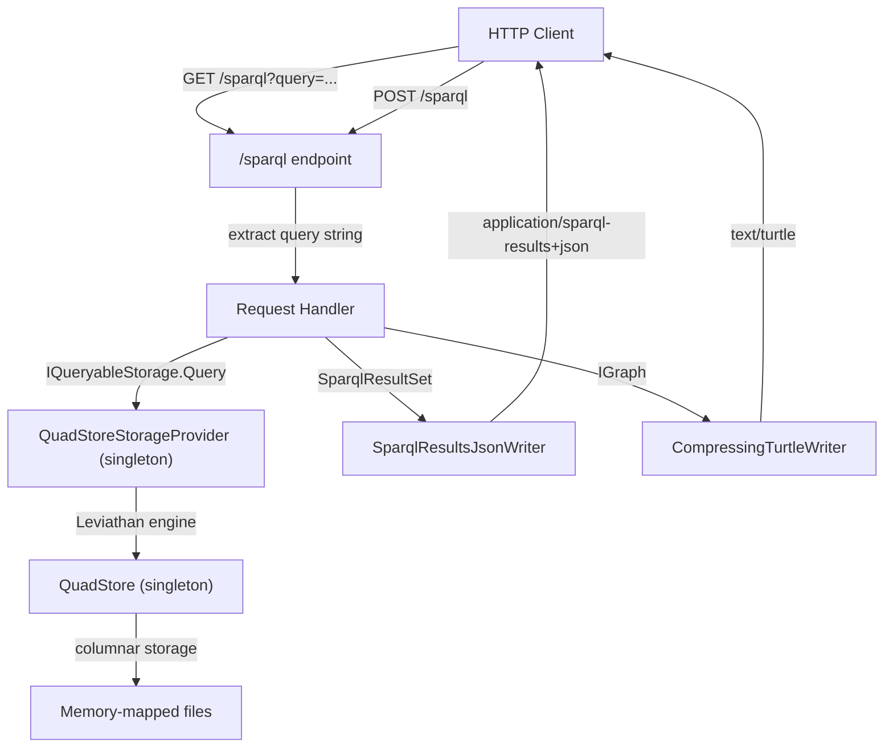
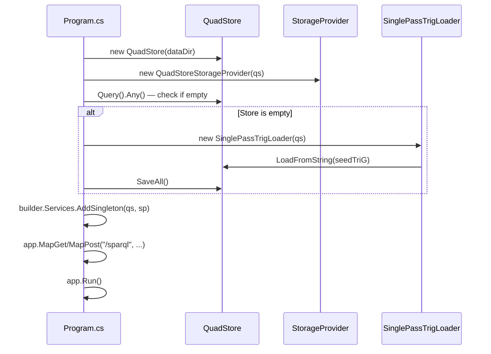

# Design Document: SPARQL Server over Minimal API

## Overview

This design describes a single-file ASP.NET Core minimal API sample (`samples/SparqlServerOverMinimalApi/Program.cs`) that exposes a SPARQL query endpoint over HTTP, backed by `QuadStore` and `QuadStoreStorageProvider` from `TripleStore.Core`. The sample demonstrates:

1. Registering `QuadStore` and `QuadStoreStorageProvider` as singletons with proper disposal
2. Conditionally seeding sample RDF data on first run
3. Handling SPARQL Protocol GET and POST bindings at `/sparql`
4. Serializing results using dotNetRDF writers (`SparqlResultsJsonWriter`, `CompressingTurtleWriter`)
5. Returning appropriate HTTP error codes for malformed queries and internal failures

The entire application lives in `Program.cs` (plus a `.csproj` update) since this is a sample meant to be read top-to-bottom.

## Architecture



### Startup Flow



### Key Design Decisions

1. **Single-file sample**: All logic in `Program.cs` using top-level statements. No separate classes or files — this is a teaching sample.
2. **Singleton lifecycle**: `QuadStore` is created before the host builds, registered as a singleton, and disposed via `app.Lifetime.ApplicationStopping`. This ensures memory-mapped files are released cleanly.
3. **Seed data via embedded string**: A small TriG string literal is loaded using `SinglePassTrigLoader.LoadFromString()` when the store is empty. No external data files needed.
4. **Content negotiation simplified**: SELECT/ASK always returns `application/sparql-results+json`; CONSTRUCT/DESCRIBE always returns `text/turtle`. This keeps the sample simple while covering both result types.
5. **SDK change to `Microsoft.NET.Sdk.Web`**: Required for `WebApplication.CreateBuilder()` and the minimal API pipeline. No additional NuGet packages needed — dotNetRDF comes transitively from QuadStore.Core.

## Components and Interfaces

### 1. Project File (`SparqlServerOverMinimalApi.csproj`)

Changes from the boilerplate:
- SDK: `Microsoft.NET.Sdk` → `Microsoft.NET.Sdk.Web`
- Remove `<OutputType>Exe</OutputType>` (Web SDK implies it)
- Add `<ProjectReference>` to `QuadStore.Core`

```xml
<Project Sdk="Microsoft.NET.Sdk.Web">
  <PropertyGroup>
    <TargetFramework>net10.0</TargetFramework>
    <ImplicitUsings>enable</ImplicitUsings>
    <Nullable>enable</Nullable>
  </PropertyGroup>
  <ItemGroup>
    <ProjectReference Include="..\..\src\QuadStore.Core\QuadStore.Core.csproj" />
  </ItemGroup>
</Project>
```

### 2. Program.cs — Logical Sections

The file is organized into these sequential sections:

#### Section A: Store Initialization
- Create `QuadStore` with a data directory path (configurable via `args` or default to `./quadstore-data`)
- Wrap in `QuadStoreStorageProvider`
- Cast to `IQueryableStorage` for SPARQL access

#### Section B: Seed Data
- Check if store is empty via `store.Query().Any()`
- If empty, define a TriG string with sample FOAF triples and load via `SinglePassTrigLoader.LoadFromString()`
- Call `store.SaveAll()` to persist seed data

#### Section C: Host Configuration
- `WebApplication.CreateBuilder(args)`
- Register `QuadStore` as singleton (`builder.Services.AddSingleton(qs)`)
- Register `QuadStoreStorageProvider` as singleton and also as `IQueryableStorage`
- Build the app

#### Section D: Endpoint — GET /sparql
- Extract `query` from query string
- Return 400 if missing
- Execute via `IQueryableStorage.Query(query)`
- Serialize result based on type (`SparqlResultSet` → JSON, `IGraph` → Turtle)
- Catch `RdfParseException` → 400, other exceptions → 500

#### Section E: Endpoint — POST /sparql
- Check `Content-Type`:
  - `application/sparql-query`: read body as query string
  - `application/x-www-form-urlencoded`: extract `query` field from form
  - Other: return 400 (unsupported content type)
- Return 400 if query is empty/missing
- Execute and serialize identically to GET handler
- Same error handling as GET

#### Section F: Serialization Helper
- A local function `SerializeResult(object result)` that:
  - If `SparqlResultSet`: writes via `SparqlResultsJsonWriter` to a `StringWriter`, returns `Results.Content(json, "application/sparql-results+json")`
  - If `IGraph`: writes via `CompressingTurtleWriter` to a `StringWriter`, returns `Results.Content(turtle, "text/turtle")`

#### Section G: Shutdown
- Register `app.Lifetime.ApplicationStopping` callback to call `qs.Dispose()`
- `app.Run()`

### 3. External Dependencies Used

| Component | Source | Purpose |
|---|---|---|
| `QuadStore` | `TripleStore.Core` | Columnar quad storage |
| `QuadStoreStorageProvider` | `TripleStore.Core` | dotNetRDF adapter, `IQueryableStorage` |
| `SinglePassTrigLoader` | `TripleStore.Core` | Load seed TriG data |
| `SparqlResultsJsonWriter` | `VDS.RDF.Writing` (dotNetRDF) | Serialize SELECT/ASK results |
| `CompressingTurtleWriter` | `VDS.RDF.Writing` (dotNetRDF) | Serialize CONSTRUCT/DESCRIBE results |
| `SparqlResultSet` | `VDS.RDF.Query` (dotNetRDF) | SELECT/ASK result type |
| `IGraph` | `VDS.RDF` (dotNetRDF) | CONSTRUCT/DESCRIBE result type |

## Data Models

### Request Models

No custom request models. The SPARQL query string is extracted directly from:
- GET: `HttpContext.Request.Query["query"]`
- POST `application/sparql-query`: `HttpContext.Request.Body` read as string
- POST `application/x-www-form-urlencoded`: `HttpContext.Request.Form["query"]`

### Response Models

No custom response models. Responses are serialized directly by dotNetRDF writers:

| Query Type | dotNetRDF Result Type | Writer | Content-Type |
|---|---|---|---|
| SELECT, ASK | `SparqlResultSet` | `SparqlResultsJsonWriter` | `application/sparql-results+json` |
| CONSTRUCT, DESCRIBE | `IGraph` | `CompressingTurtleWriter` | `text/turtle` |

### Error Responses

Plain text responses with appropriate HTTP status codes:
- **400 Bad Request**: Missing query parameter, empty query body, unsupported content type, SPARQL parse errors
- **500 Internal Server Error**: Unexpected execution errors (generic message, no stack traces)

### Seed Data

A small embedded TriG document with FOAF triples for testing:

```trig
@prefix foaf: <http://xmlns.com/foaf/0.1/> .
@prefix ex:   <http://example.org/> .

{
  ex:alice foaf:name "Alice" ;
           foaf:knows ex:bob .
  ex:bob   foaf:name "Bob" ;
           foaf:knows ex:alice .
}
```

This provides enough data to demonstrate SELECT queries (`SELECT ?s ?name WHERE { ?s foaf:name ?name }`) and CONSTRUCT queries.


## Correctness Properties

*A property is a characteristic or behavior that should hold true across all valid executions of a system — essentially, a formal statement about what the system should do. Properties serve as the bridge between human-readable specifications and machine-verifiable correctness guarantees.*

### Property 1: Response content-type matches query result type

*For any* valid SPARQL query executed against the endpoint, if the query produces a `SparqlResultSet` (SELECT/ASK), the response content-type SHALL be `application/sparql-results+json`; if the query produces an `IGraph` (CONSTRUCT/DESCRIBE), the response content-type SHALL be `text/turtle`.

**Validates: Requirements 4.3, 4.4**

### Property 2: Protocol equivalence across submission methods

*For any* valid SPARQL query, submitting it via HTTP GET with a `query` parameter, via HTTP POST with content-type `application/sparql-query`, and via HTTP POST with content-type `application/x-www-form-urlencoded` containing a `query` field SHALL all produce identical response bodies and identical response content-types.

**Validates: Requirements 4.1, 5.1, 5.2**

### Property 3: Malformed SPARQL queries return 400

*For any* string that is not a valid SPARQL query, submitting it to the `/sparql` endpoint SHALL return HTTP 400, and the response body SHALL contain a non-empty error message.

**Validates: Requirements 6.1**

## Error Handling

### SPARQL Parse Errors (400)

When `IQueryableStorage.Query()` throws a `RdfParseException` (from dotNetRDF's SPARQL parser), the endpoint catches it and returns:
- Status: `400 Bad Request`
- Body: The exception message (e.g., "Unexpected token 'SELCT' at line 1, column 1")
- Content-Type: `text/plain`

### Missing/Empty Query (400)

When the query parameter is absent or empty:
- GET without `?query=`: return 400 with "Missing required 'query' parameter."
- POST `application/sparql-query` with empty body: return 400 with "Request body is empty."
- POST `application/x-www-form-urlencoded` without `query` field: return 400 with "Missing required 'query' form field."
- POST with unsupported content type: return 400 with "Unsupported Content-Type. Use 'application/sparql-query' or 'application/x-www-form-urlencoded'."

### Unexpected Errors (500)

Any other exception during query execution:
- Status: `500 Internal Server Error`
- Body: "An internal error occurred while processing the query."
- No stack traces or internal details exposed
- Content-Type: `text/plain`

### Error Handling Implementation

```csharp
try
{
    var result = queryable.Query(query);
    return SerializeResult(result);
}
catch (Exception ex) when (ex is RdfParseException || ex.InnerException is RdfParseException)
{
    var parseEx = ex as RdfParseException ?? ex.InnerException as RdfParseException;
    return Results.Text(parseEx!.Message, statusCode: 400);
}
catch (Exception)
{
    return Results.Text("An internal error occurred while processing the query.", statusCode: 500);
}
```

## Testing Strategy

### Property-Based Testing

**Library**: [FsCheck.Xunit](https://github.com/fscheck/FsCheck) (FsCheck 3.x with xUnit integration)

FsCheck is the standard property-based testing library for .NET. It integrates with xUnit (already used in this project) and supports custom generators for domain-specific types.

**Configuration**: Each property test runs a minimum of 100 iterations.

**Property tests to implement**:

1. **Feature: sparql-server-sample, Property 1: Response content-type matches query result type**
   - Generator: produce random valid SELECT and CONSTRUCT queries against the seed data schema (varying variable names, WHERE patterns)
   - Oracle: check that `Content-Type` header matches expected value based on query type
   - Minimum 100 iterations

2. **Feature: sparql-server-sample, Property 2: Protocol equivalence across submission methods**
   - Generator: produce random valid SPARQL queries
   - For each query, submit via all three methods (GET, POST direct, POST form-encoded)
   - Oracle: assert all three responses have identical status codes, content-types, and bodies
   - Minimum 100 iterations

3. **Feature: sparql-server-sample, Property 3: Malformed SPARQL queries return 400**
   - Generator: produce random strings that are not valid SPARQL (random alphanumeric, partial keywords, SQL statements, etc.)
   - Oracle: assert HTTP 400 status and non-empty body
   - Minimum 100 iterations

### Unit Tests (xUnit)

Unit tests cover specific examples, edge cases, and integration points:

1. **Project configuration**: Verify `.csproj` uses `Microsoft.NET.Sdk.Web`, targets `net10.0`, references `QuadStore.Core`
2. **Seed data loading**: Start with empty store → verify data is present; start with existing data → verify no duplicates
3. **GET missing query**: `GET /sparql` without `?query=` → 400
4. **POST empty body**: `POST /sparql` with `application/sparql-query` and empty body → 400
5. **POST missing form field**: `POST /sparql` with `application/x-www-form-urlencoded` without `query` → 400
6. **POST unsupported content type**: `POST /sparql` with `text/plain` → 400
7. **Successful SELECT**: `GET /sparql?query=SELECT...` → 200, valid JSON, correct content-type
8. **Successful CONSTRUCT**: `GET /sparql?query=CONSTRUCT...` → 200, valid Turtle, correct content-type
9. **Internal error response**: Verify 500 response does not contain stack traces
10. **Singleton lifecycle**: Verify `QuadStore` disposal on shutdown

### Test Infrastructure

Tests use `WebApplicationFactory<Program>` (from `Microsoft.AspNetCore.Mvc.Testing`) to spin up an in-memory test server. Each test gets an isolated temp directory for `QuadStore` data to avoid cross-test interference.
