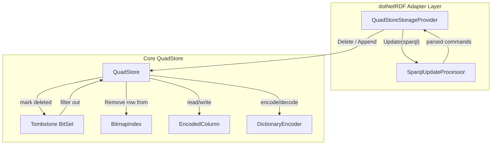
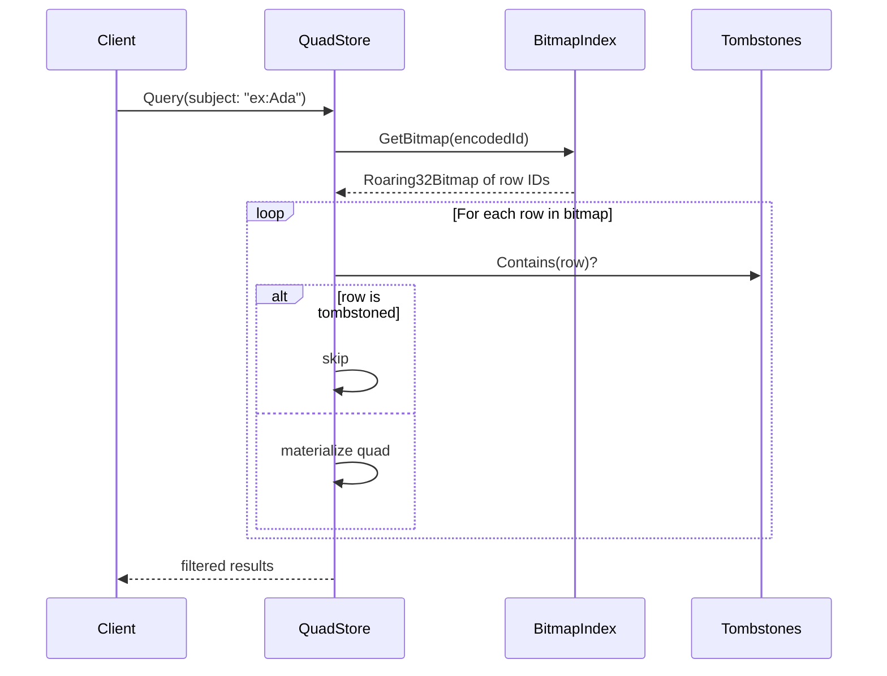
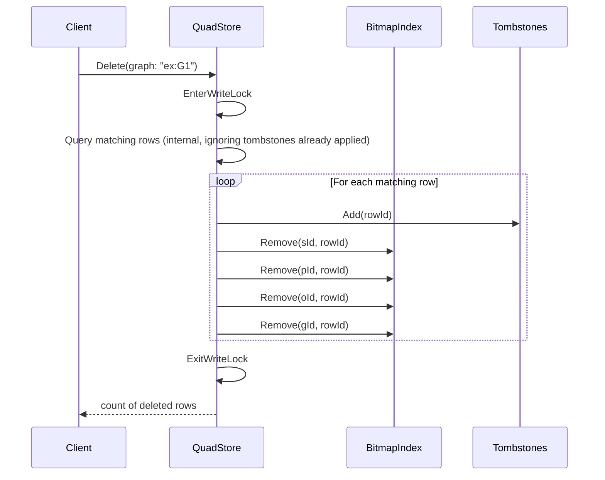

# Design Document: SPARQL Update Operations

## Overview

This design adds delete and update capabilities to the currently append-only QuadStore, and wires SPARQL 1.1 Update support through the `QuadStoreStorageProvider` dotNetRDF adapter. The core change is a tombstone-based soft-delete mechanism in `QuadStore` that marks rows as deleted without physically removing data from the columnar storage. On top of this, the adapter gains support for `DeleteGraph`, `UpdateGraph` with removals, and a SPARQL Update parser that handles `INSERT DATA`, `DELETE DATA`, `DELETE/INSERT WHERE`, `DROP`, and `CLEAR`.

The design leverages dotNetRDF's existing `SparqlUpdateParser` to parse SPARQL Update commands, avoiding a custom parser. The parsed command set is walked and each operation is dispatched to the appropriate QuadStore primitive (append or delete-by-pattern).

## Architecture



### Key Design Decisions

1. **Tombstone-based soft delete**: Rather than compacting columns (which would invalidate all row IDs and require rebuilding every bitmap), deleted rows are tracked in a `HashSet<long>` (or `Roaring64Bitmap` if performance demands it). The `Query` method skips tombstoned rows. This is the simplest correct approach and avoids the complexity of column compaction.

2. **Bitmap index removal on delete**: When a row is tombstoned, its row ID is also removed from the four bitmap indexes (S, P, O, G). This keeps bitmap intersection queries correct without needing a post-filter step, maintaining query performance.

3. **dotNetRDF SparqlUpdateParser for SPARQL Update**: The adapter uses `VDS.RDF.Parsing.SparqlUpdateParser` to parse SPARQL Update strings into a `SparqlUpdateCommandSet`. Each command is pattern-matched and dispatched. This avoids writing a custom SPARQL Update parser and ensures spec-compliant parsing.

4. **WHERE clause evaluation via Leviathan**: For `DELETE/INSERT WHERE`, the WHERE pattern is evaluated by building a snapshot dataset (same approach as the existing `Query` method) and running it through the Leviathan query processor. The resulting bindings are then used to instantiate DELETE and INSERT templates.

5. **Removals before additions in UpdateGraph**: When both additions and removals are provided, removals are processed first. This matches the SPARQL Update semantics where DELETE is applied before INSERT.

## Components and Interfaces

### QuadStore (modified)

New public methods:

```csharp
/// <summary>
/// Delete all quads matching the given pattern. Null components act as wildcards.
/// </summary>
public int Delete(string? subject = null, string? predicate = null,
                  string? obj = null, string? graph = null);
```

Internal changes:
- Add `private readonly HashSet<long> _tombstones = new();`
- Modify `Query()` to skip rows present in `_tombstones`
- Modify `SaveAll()` to persist tombstones
- Modify `LoadAll()` to restore tombstones

### BitmapIndex (modified)

New public method:

```csharp
/// <summary>
/// Remove a row ID from the bitmap for the given dictionary ID.
/// </summary>
public void Remove(int dictId, long row);
```

### QuadStoreStorageProvider (modified)

Changes:
- `DeleteSupported` returns `true`
- `DeleteGraph(Uri)` and `DeleteGraph(string)` delegate to `QuadStore.Delete(graph: ...)`
- `UpdateGraphInternal` handles non-empty removals by calling `QuadStore.Delete` per triple
- `Update(string sparqlUpdate)` parses and executes SPARQL Update commands
- `IOBehaviour` adds `CanUpdateDeleteTriples`

### SparqlUpdateProcessor (new internal helper)

A private helper class or set of methods within `QuadStoreStorageProvider` that walks a `SparqlUpdateCommandSet` and dispatches each command:

| SPARQL Command | Action |
|---|---|
| `INSERT DATA` | Append quads via `QuadStore.Append` |
| `DELETE DATA` | Delete quads via `QuadStore.Delete` |
| `DELETE WHERE` | Evaluate WHERE, delete matching quads |
| `DELETE/INSERT WHERE` | Evaluate WHERE, delete from DELETE template, insert from INSERT template |
| `DROP GRAPH <uri>` | `QuadStore.Delete(graph: uri)` |
| `DROP ALL` | `QuadStore.Delete()` (all nulls) |
| `DROP DEFAULT` | `QuadStore.Delete(graph: "")` |
| `CLEAR GRAPH <uri>` | Same as DROP GRAPH |
| `CLEAR ALL` | Same as DROP ALL |
| `CLEAR DEFAULT` | Same as DROP DEFAULT |


## Data Models

### Tombstone Storage

The tombstone set is a `HashSet<long>` of deleted row indices. This is chosen over a `bool[]` or `BitArray` because:
- The store may have millions of rows but few deletions — a set is more memory-efficient for sparse deletes
- `HashSet<long>.Contains` is O(1) and fast enough for the per-row check in `Query`
- If deletion density grows high, a future optimization could switch to `Roaring64Bitmap`

### Tombstone Persistence Format

Tombstones are persisted to `tombstones.bin` in the store root directory:

```
[int32: version = 1]
[int32: count]
[int64: rowId] × count
```

Row IDs are written in sorted order for deterministic output. On load, they are read back into the `HashSet<long>`.

### SPARQL Update Command Model

No new data model is needed — dotNetRDF's `SparqlUpdateCommandSet` and its command types (`InsertDataCommand`, `DeleteDataCommand`, `ModifyCommand`, `DropCommand`, `ClearCommand`) are used directly. The adapter walks these command objects and translates them to QuadStore operations.

### Modified Query Flow



### Modified Delete Flow




## Correctness Properties

*A property is a characteristic or behavior that should hold true across all valid executions of a system — essentially, a formal statement about what the system should do. Properties serve as the bridge between human-readable specifications and machine-verifiable correctness guarantees.*

### Property 1: Delete-then-query exclusion

*For any* QuadStore containing any set of quads, and *for any* delete pattern (any combination of non-null subject, predicate, object, graph filters), after calling `Delete` with that pattern, `Query` with no filters shall return a set that contains none of the quads that matched the delete pattern, and all quads that did not match the delete pattern shall still be present.

**Validates: Requirements 1.1, 1.2, 2.2**

### Property 2: Deleted graph excluded from ListGraphs

*For any* QuadStore containing quads across multiple named graphs, and *for any* graph URI present in the store, after deleting all quads in that graph, `ListGraphNames` shall not contain that graph URI, and all other graph URIs shall remain present.

**Validates: Requirements 3.1, 3.2**

### Property 3: UpdateGraph removals delete matching quads

*For any* set of triples previously added to a graph via the StorageProvider, calling `UpdateGraph` with those triples in the removals collection shall result in those triples no longer being returned by `LoadGraph` for that graph.

**Validates: Requirements 4.1**

### Property 4: INSERT DATA round-trip

*For any* set of valid RDF triples and *for any* graph URI, executing a SPARQL `INSERT DATA { GRAPH <uri> { triples } }` command via `Update` shall result in all specified triples being queryable in the specified graph. When no GRAPH clause is used, triples shall appear in the default graph (empty string URI).

**Validates: Requirements 5.1, 5.2, 5.3**

### Property 5: DELETE DATA removes specified quads

*For any* set of quads present in the store, executing a SPARQL `DELETE DATA { GRAPH <uri> { triples } }` command via `Update` shall result in those quads no longer being returned by `Query`, while all other quads remain unaffected.

**Validates: Requirements 6.1, 6.2, 6.3**

### Property 6: SaveAll/LoadAll round-trip preserves deletion state

*For any* QuadStore that has had a sequence of appends and deletes applied, calling `SaveAll` and then creating a new QuadStore from the same directory (which calls `LoadAll`) shall produce a store where `Query` with no filters returns the exact same set of quads as the original store.

**Validates: Requirements 9.1, 9.2, 9.3**

## Error Handling

### QuadStore.Delete

- If all four filter parameters are null, delete all quads (not an error — this is the "clear all" semantic).
- No exception is thrown when the pattern matches zero rows — the method returns 0.
- `ArgumentException` is not thrown for null parameters since nulls are valid wildcards.

### QuadStoreStorageProvider.DeleteGraph

- No longer throws `RdfStorageException`. Delegates to `QuadStore.Delete(graph: uri)`.
- If the graph URI is null or empty, deletes quads in the default graph.

### QuadStoreStorageProvider.UpdateGraph (removals)

- No longer throws `RdfStorageException` when removals are non-empty.
- Each removal triple is converted to a fully-specified delete pattern (all four components set). If the triple doesn't exist, the delete is a no-op.

### QuadStoreStorageProvider.Update (SPARQL Update)

- Wraps dotNetRDF's `SparqlUpdateParser.ParseFromString` in a try/catch. If parsing fails, throws `RdfStorageException` with the parse error message.
- For `DROP GRAPH <uri>` without `SILENT`: if the graph does not exist in the store (checked via `ListGraphNames`), throws `RdfStorageException`.
- For `DROP GRAPH <uri>` with `SILENT`: if the graph does not exist, completes without error.
- Unsupported SPARQL Update commands (e.g., `LOAD`, `CREATE`, `ADD`, `MOVE`, `COPY`) throw `RdfStorageException` with a descriptive message listing the unsupported command type.

### BitmapIndex.Remove

- If the dictionary ID does not exist in the index, the method is a no-op (no exception).
- If the row ID is not present in the bitmap for the given dictionary ID, the method is a no-op.

## Testing Strategy

### Unit Tests (xUnit + FluentAssertions)

Unit tests cover specific examples, edge cases, error conditions, and integration points:

- **QuadStore.Delete**: Delete single quad, delete by each filter dimension, delete-all (all nulls), delete non-existent pattern returns 0, delete with multiple matching rows
- **BitmapIndex.Remove**: Remove existing row, remove non-existent row, remove from non-existent dictionary ID
- **StorageProvider.DeleteGraph**: Both Uri and string overloads work, DeleteSupported returns true, IOBehaviour includes CanUpdateDeleteTriples
- **StorageProvider.UpdateGraph**: Removals processed before additions, removal of non-existent triple is no-op, backward compatibility with null removals
- **SPARQL INSERT DATA**: With and without GRAPH clause, invalid syntax throws RdfStorageException
- **SPARQL DELETE DATA**: With and without GRAPH clause, non-existent quad is no-op, invalid syntax throws
- **SPARQL DELETE/INSERT WHERE**: Pattern evaluation with snapshot semantics, invalid syntax throws
- **SPARQL DROP/CLEAR**: DROP GRAPH, DROP ALL, DROP DEFAULT, CLEAR variants, SILENT keyword, non-SILENT on missing graph throws
- **Persistence**: SaveAll/LoadAll preserves tombstones, tombstones.bin format
- **Thread safety**: Concurrent deletes and queries stress test

### Property-Based Tests (FsCheck.Xunit)

The project already includes `FsCheck.Xunit 3.3.2`. Each correctness property is implemented as a single FsCheck property test with a minimum of 100 iterations.

Each test is tagged with a comment referencing the design property:
```
// Feature: sparql-update-operations, Property {N}: {title}
```

| Property | Test Description | Generator Strategy |
|---|---|---|
| Property 1 | Generate random quads, append them, generate a random delete pattern from existing values, delete, verify Query correctness | Random strings for S/P/O/G, random subset selection for delete pattern |
| Property 2 | Generate quads across multiple graphs, delete one graph, verify ListGraphNames | Random graph URIs, random selection of graph to delete |
| Property 3 | Generate triples, add via SaveGraph, remove subset via UpdateGraph, verify LoadGraph | Random URI nodes for triples |
| Property 4 | Generate triples, build INSERT DATA SPARQL string, execute via Update, verify Query | Random URI strings, SPARQL string construction |
| Property 5 | Generate quads, append, build DELETE DATA SPARQL string, execute, verify removal | Random URI strings, SPARQL string construction |
| Property 6 | Generate random appends and deletes, SaveAll, LoadAll into new instance, compare Query results | Random sequence of append/delete operations |

FsCheck generators will produce valid URI-like strings (e.g., `http://example.org/{random}`) to avoid issues with dotNetRDF URI parsing. Custom `Arbitrary` instances will be defined for quad components.
